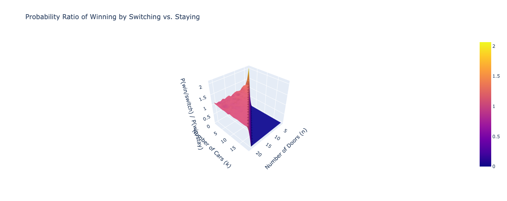

# Monty Hall Problem Probability Ratio Calculator

## Description
This Python program calculates the probability ratio of winning by switching versus staying in the Generalized Monty Hall problem.

## Prerequisites
- Python 3.x
- numpy
- plotly

## How to Run
1. Ensure Python 3.x is installed.
2. Install dependencies:
   ```bash
   pip install numpy plotly
   ```
3. Navigate to the extracted directory.
4. ```bash
    python monty_hall.py
    ```

## Example
After running the program, you will see a surface plot depicting the probability ratio of winning by switching versus staying for various configurations of the number of doors and cars.



## Code Explanation
- The program simulates the Monty Hall problem for different numbers of doors and cars.
- It calculates the probability ratio of winning by switching versus staying for each configuration.
- The results are plotted using Plotly to visualize how the probability ratio changes with different parameters.
